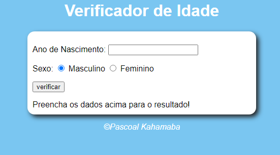

# Verificador de Idade

Este `projeto` foi desenvolvido para fins de exercícios em `Javascript`. O projeto funciona da seguinte forma o `usuário` digita o `Ano de Nascimento` logo abaixo tem duas `opções` de sexo claro o primeiro `Masculino` e o segundo `Feminino`, inicialmente o projeto começa com o sexo masculino mas clicando nuns dos sexos o sistema vai `retornar` uma respectiva idade mediante o sexo escolhido, para iniciar o projeto o usuário tem que clicar no `botão` abaixo `verificar` mas antes de clicar este botão tem que digitar primeiramente o ano de nascimento, e este ano tem que ser menor que o ano atual caso contrário var retornar um `erro` com a seguinte mensagem `[ERRO] Verifique os dados e tente novamente!`. E algo legal ao aparecer a idade desejada também aparece uma `foto` e o sistema `analisa` a idade e rapidamente diz se ela corresponde a um `Bebe` `jovem` `Adulto` e por ultimo `Idoso`. Se tudo estiver nos `conformes` ao clicar no botão verificar vai aparecer a seguinte informação `Detectamos um "aqui vêm o sexo" com X idade` com uma foto dependendo do sexo escolhido.

## Tecnologias

As seguintes ferramentas foram usadas na constuição deste projeto:

- HTML
- CSS
- JAVASCRIPT

#

Feito por Pascoal Kahamba meu [Linkedin](https://www.linkedin.com/in/pascoal-kahamba-7b43bb233?lipi=urn%3Ali%3Apage%3Ad_flagship3_profile_view_base_contact_details%3BTg8LEKayToyytOX1pVAQ%2Bg%3D%3D)

[👉Clique aqui se desejas ver aplicação rodando..👈😎](https://)
